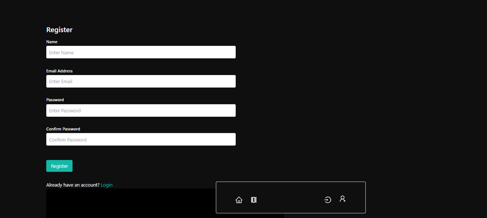
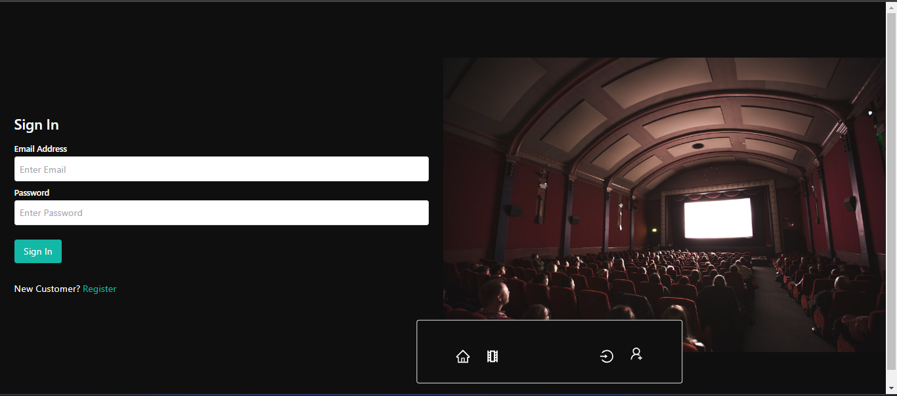
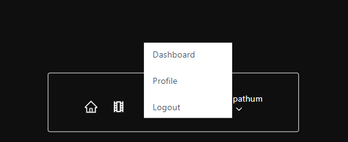

<!-- this is how create the project -->

npx create-vite frontend --template react

cd frontend

npm i => install all the packages

back to movies
cd ..
then ,
npm init -y => to get the "package.json"

inside the "package.json" add "type":"module",

In the backend we have to install lot of packages

npm i bcryptjs body-parser concurrently cookie-parser dotenv express jsonwebtoken mongoose multer nodemon

now back to frontend => cd frontend

npm i react-icons react-redux @reduxjs/toolkit react-router react-router-dom react-slick react-toastify slick-carousel

edit the package like that,
"scripts": {
"dev": "concurrently \"npm run backend\" \"npm run frontend\"",
"frontend": "cd frontend && npm run dev",
"backend": "nodemon backend/index.js"
},

then if you want to run frontend then , npm run frontend
and backend, npm run backend

you need run both then npm run dev

ok , cd backend
create several folders as ,
01.config
02.controllers
03.middlewares
04.routes
05.utils
and index.js

inside the config create connection of database
db.js

after fronend install the tailwind css with vite you can refer the tailwincss

Register Page

After regitered

Cookies generated

login page

logout

